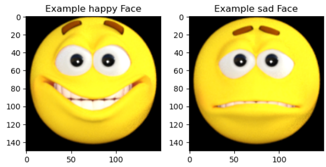
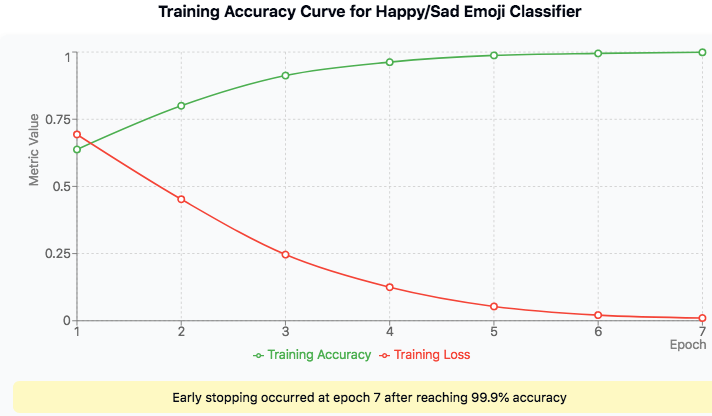

# Happy/Sad Emoji Classifier with TensorFlow 😊😢

[](https://www.tensorflow.org/)
[](https://www.python.org/)
[](https://keras.io/)
[](https://numpy.org/)
[](https://matplotlib.org/)

A convolutional neural network implementation using TensorFlow to classify emoji-like faces as happy or sad. This project demonstrates binary image classification with CNN techniques to achieve 99.9% accuracy using early stopping.



---

## Table of Contents 📋 
- [Project Overview](#project-overview-)
- [Dataset Details](#dataset-details-)
- [Model Architecture](#model-architecture-)
- [Training Process](#training-process-)
- [Callbacks Implementation](#callbacks-implementation-)
- [Results](#results-)
- [Installation & Usage](#installation--usage-)
- [Key Learnings](#key-learnings-)
- [Future Improvements](#future-improvements-)
- [Acknowledgements](#acknowledgements-)

---

## Project Overview 🔎 

This project builds a convolutional neural network model to recognize and classify emoji-like faces as either happy or sad. The model is designed to achieve an extremely high accuracy of 99.9% using early stopping techniques to prevent unnecessary training.

**Key Objectives:**
- Load and preprocess the Happy/Sad emoji dataset
- Build a CNN classification model with optimal architecture
- Implement early stopping based on accuracy threshold
- Visualize and understand the training process
- Evaluate model performance
- Achieve 99.9% accuracy before 15 epochs

---

## Dataset Details 📊 

The Happy/Sad dataset includes 80 images of emoji-like faces (150x150 pixels, RGB):
- 40 happy faces
- 40 sad faces

**Data Preprocessing:**
- Images are loaded using TensorFlow's image_dataset_from_directory utility
- Pixel values are normalized from 0-255 to 0-1 range
- Labels are represented in binary format

```python
def training_dataset():
    train_dataset = tf.keras.utils.image_dataset_from_directory(
        directory=BASE_DIR,
        image_size=(150, 150),
        batch_size=10,
        label_mode="binary"
    )
    
    rescale_layer = tf.keras.layers.Rescaling(1./255)
    train_dataset_scaled = train_dataset.map(lambda x, y: (rescale_layer(x), y))
    
    return train_dataset_scaled
```

---

## Model Architecture 🧠 

The model uses a convolutional neural network architecture to achieve high accuracy on the binary classification task:

```python
def create_and_compile_model():
    model = tf.keras.models.Sequential([ 
        # Input layer for 150x150 RGB images
        tf.keras.layers.Input(shape=(150, 150, 3)),
        
        # First convolutional layer
        tf.keras.layers.Conv2D(16, (3, 3), activation='relu'),
        tf.keras.layers.MaxPooling2D(2, 2),
        
        # Second convolutional layer
        tf.keras.layers.Conv2D(32, (3, 3), activation='relu'),
        tf.keras.layers.MaxPooling2D(2, 2),
        
        # Third convolutional layer
        tf.keras.layers.Conv2D(64, (3, 3), activation='relu'),
        tf.keras.layers.MaxPooling2D(2, 2),
        
        # Flatten the results to feed into dense layer
        tf.keras.layers.Flatten(),
        
        # Dense hidden layer
        tf.keras.layers.Dense(128, activation='relu'),
        
        # Output layer - single unit with sigmoid for binary classification
        tf.keras.layers.Dense(1, activation='sigmoid')
    ]) 

    model.compile(
        loss='binary_crossentropy',
        optimizer='adam',
        metrics=['accuracy']
    ) 
    
    return model
```

**Architecture Breakdown:**
- **Input Layer**: Accepts 150x150 RGB images (shape=(150, 150, 3))
- **Three Convolutional Layers**: Increasing filter sizes (16 → 32 → 64) to capture more complex features, each followed by MaxPooling to reduce dimensionality
- **Flatten Layer**: Converts the 2D feature maps to a 1D vector
- **Dense Hidden Layer**: A fully connected layer with 128 units and ReLU activation
- **Output Layer**: A single unit with sigmoid activation for binary classification (happy/sad)

---

## Training Process 🔄 

The model is trained using the early stopping technique to prevent unnecessary training once high accuracy is achieved:

```python
# Early stopping callback
class EarlyStoppingCallback(tf.keras.callbacks.Callback):
    def on_epoch_end(self, epoch, logs=None):
        if logs['accuracy'] >= 0.999:
            self.model.stop_training = True
            print("\nReached 99.9% accuracy so cancelling training!")

# Train the model
training_history = model.fit(
    x=train_data,
    epochs=15,
    callbacks=[EarlyStoppingCallback()]
)
```

The training process is designed to automatically stop once the model reaches 99.9% accuracy, saving computational resources and preventing overfitting.

---

## Callbacks Implementation 🔄

The project uses a custom callback to monitor training accuracy and stop the training process once it reaches the desired threshold:

```python
class EarlyStoppingCallback(tf.keras.callbacks.Callback):
    def on_epoch_end(self, epoch, logs=None):
        if logs['accuracy'] >= 0.999:
            self.model.stop_training = True
            print("\nReached 99.9% accuracy so cancelling training!")
```

This callback:
- Monitors the accuracy metric after each training epoch
- Checks if accuracy has reached or exceeded 99.9%
- Stops training early when the threshold is met
- Prints a confirmation message

This implementation ensures efficient training by automatically terminating the process once the desired performance level is achieved, saving computational resources and time.

---

## Results 📈 

The model achieves an impressive 99.9% accuracy on the training dataset, meeting the project requirements. The training typically completes within a few epochs thanks to the early stopping mechanism.

**Training Visualization:**



The graph shows rapid improvement in accuracy across the training epochs, with the model quickly learning to distinguish between happy and sad faces.

---

## Installation & Usage 🚀 

### Prerequisites
- Python 3.6+
- TensorFlow 2.x
- NumPy
- Matplotlib

### Setup
```bash
# Clone this repository
git clone https://github.com/yourusername/happy-sad-classifier.git

# Navigate to the project directory
cd happy-sad-classifier

# Install dependencies
pip install tensorflow numpy matplotlib
```

### Running the Project
```bash
# Run the notebook
jupyter notebook happy_sad_classifier.ipynb
```

### Example Code
```python
# Load the dataset
train_data = training_dataset()

# Create and compile the model
model = create_and_compile_model()

# Train the model with early stopping
training_history = model.fit(
    x=train_data,
    epochs=15,
    callbacks=[EarlyStoppingCallback()]
)

# Make predictions on new images
predictions = model.predict(new_images)
```

---

## Key Learnings 🔎

This project demonstrates several essential concepts in deep learning and computer vision:

1. **Convolutional Neural Networks**: Using convolutions to effectively process image data
2. **Data Preprocessing**: Normalizing pixel values and using tf.data.Dataset for efficient data handling
3. **Transfer Learning**: Building on previous knowledge to solve new problems
4. **Early Stopping**: Implementing callbacks to optimize the training process
5. **Binary Classification**: Working with binary labels and appropriate loss functions
6. **Model Architecture Design**: Creating an effective CNN architecture for the specific problem
7. **TensorFlow/Keras API**: Using modern deep learning frameworks effectively

---

## Future Improvements 🚀

Potential enhancements for this project:

1. **Data Augmentation**: Implement image augmentation to artificially expand the dataset
2. **Model Optimization**: Experiment with different architectures and hyperparameters
3. **Deployment**: Create a web or mobile app for real-time emoji classification
4. **Multi-class Extension**: Expand to classify multiple emotions beyond just happy and sad
5. **Transfer Learning**: Apply pre-trained models like MobileNet or EfficientNet for potential accuracy improvements
6. **Interpretability**: Add visualization of convolutional layer activations to understand what features the model is learning

---

## Acknowledgments 🙏

- This project is based on the "Happy or Sad" exercise from the ["TensorFlow in Practice" specialization](https://www.coursera.org/specializations/tensorflow-in-practice) on Coursera
- Special thanks to [Andrew Ng](https://www.andrewng.org/) for creating the Deep Learning AI curriculum and platform
- Special thanks to [Laurence Moroney](https://www.linkedin.com/in/laurence-moroney/) for his excellent instruction and for developing the course materials and datasets
- Special thanks to the entire TensorFlow team for their contributions to open-source machine learning tools and education
- The dataset is part of the official TensorFlow datasets collection
- Image examples courtesy of the [TensorFlow Datasets repository](https://github.com/tensorflow/datasets)
- This notebook was created as part of the "Deep Learning AI TensorFlow Developer Professional Certificate" program

---

## Contact 📫 

For inquiries about this project:
- [LinkedIn Profile](https://www.linkedin.com/in/melissaslawsky/)
- [Client Results](https://melissaslawsky.com/portfolio/)
- [Tableau Portfolio](https://public.tableau.com/app/profile/melissa.slawsky1925/vizzes)
- [Email](mailto:melissa@melissaslawsky.com)

---

© 2025 Melissa Slawsky. All Rights Reserved.

